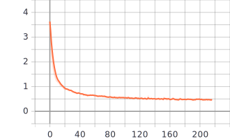
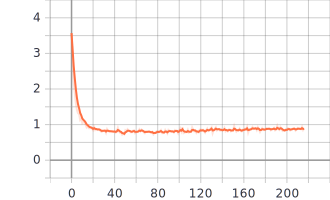

# PointNet-TF-2.0
### This project is reimeplementation of [PointNet](https://arxiv.org/abs/1612.00593) in tensorflow 2.0. The motivation behind this project is to understand the architecture and its validation on ModelNet[https://modelnet.cs.princeton.edu/] dataset . 

# Getting Started 
Clone the github repository and follow the steps below 
## Prerequisites
Here is a list of software will be required to build this model.
1. Python >= 3.0+
2. Tensorflow 2.0
3. Numpy
4. Scipy
5. Open3d (for visualization)

## Creating conda environment
I have included pointnet_env.yml which will allow you to create required environment for this model.

```
conda env create -f pointnet_env.yml
```
## Training the model
```
python train.py
```

You can check the available parameters to modify using

```
python train.py --help
```

## To visualize the prediction on trained model 

```
python inference.py --filepath pointcloud_file --weights_path checkpoint 
```

## Sample results and graphs

<div align="center">
  <p>  </p>
  <p> Plot of Training Accuracy </p>
</div>


<div align="center">
  <p>  </p>
  <p> Plot of Training Loss </p>
</div>


<div align="center">
  <p>  </p>
  <p> Plot of Validation Accuracy </p>
</div>


<div align="center">
  <p>  </p>
  <p> Plot of Validation Loss </p>
</div>

## Inference Result on sample data
